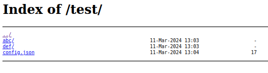
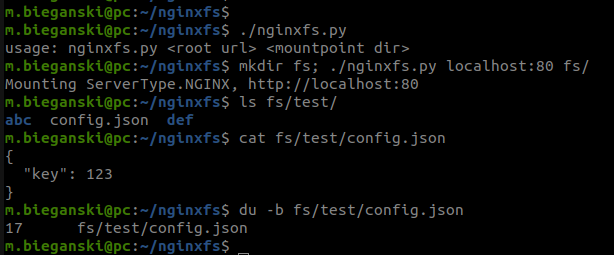

# Functionality

Mount autoindex-based nginx/Apache web server in READ-ONLY mode on your local machine, in order to simplify files access.

# Performance

Software is not a limitation for operations like file copy. On my 1 gigabit Ethernet connection I got 100MiB+ of bandwidth, measured using `dd` tool.

# Limitations

* At any time, each file can be opened by only one process. In other words, you can have two processes `cat a` and `cat b` working at the same time, but no `cat a` and `cat a`.